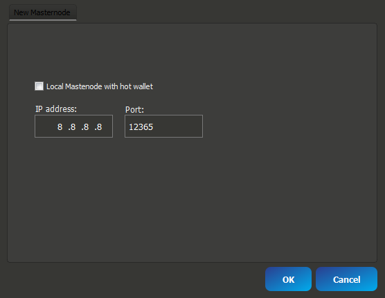

Masternode Setup Guide
=======================
## Introduction ##

This guide is for a single masternode, on a Ubuntu 16.04 64bit server (VPS) running headless and will be controlled from the wallet on your local computer (Control wallet). The wallet on the the VPS will be referred to as the Remote wallet.
You will need your server details for progressing through this guide.

First the basic requirements:

 * 4,000 ANK
 * A main computer (Your everyday computer) – This will run the control wallet, hold your collateral 4,000 ank and can be turned on and off without affecting the masternode.
 * Masternode Server (VPS – The computer that will be on 24/7)
 * A unique IP address for your VPS / Remote wallet

(For security reasons, you’re are going to need a different IP for each masternode you plan to host)

The basic reasoning for these requirements is that, you get to keep your ANK in your local wallet and host your masternode remotely, securely.

## Configuration ##

1) Using the wallet, open "Masternodes" page and press "New Masternode" button:
2) enter the your unique public ip address for your VPS, uncheck "Local Masternode with hot wallet" checkbox and click ok:



3) Click on "details" button and copy all text to clipboard
4) Install the latest version of the ANK wallet onto your masternode. The lastest version can be found here: https://github.com/AnkerPay/Anker

    Note: If this is the first time running the wallet in the VPS, you’ll need to attempt to start the wallet 
    ```
    ./ankerd
    ```
     this will place the config files in your ~/.anker data directory
    ```
    press CTRL+C
    ```
    to exit / stop the wallet

5) Now on the masternodes, find the ANK data directory here.(Linux: ~/.anker)
    ```
    cd ~/.anker
    ```
6) Open the anker.conf by typing and paste your wallet generated configuration from clipboard

## Start your masternode ##

7) Now, you need to finally start these things in this order
– Start the daemon client in the VPS. First go back to your installed wallet directory, 
```
./ankerd
```
– From the Control wallet maternodes page press "Start all" button

Congratulations! You have successfully created your masternode!
